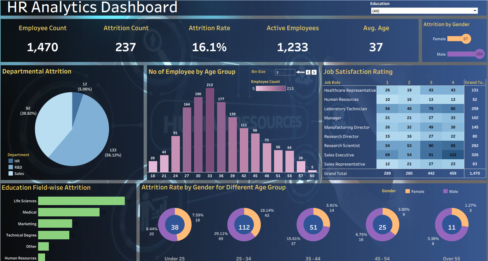

# HR Analytics Dashboard

## Overview

Transform raw HR data into actionable insights with this comprehensive analytics dashboard. This project demonstrates the power of data visualization in understanding workforce dynamics and driving strategic human resource decisions.

## Project Description

Using Tableau's robust visualization capabilities, this dashboard analyzes critical HR metrics sourced from Excel datasets. The project provides deep insights into employee demographics, attrition patterns, performance indicators, compensation trends, and departmental analytics. Interactive visualizations enable stakeholders to explore data from multiple perspectives, identifying patterns and trends that might otherwise remain hidden in spreadsheets.

## Key Features

- **Employee Demographics Analysis**: Visualize workforce composition by age, gender, department, and tenure
- **Attrition Tracking**: Identify turnover patterns and high-risk employee segments
- **Performance Metrics**: Monitor employee performance across teams and departments
- **Compensation Insights**: Analyze salary distributions and equity across the organization
- **Interactive Dashboards**: Filter and drill down into specific metrics for detailed exploration

## Technology Stack

- **Data Source**: Excel
- **Visualization Tool**: Tableau Desktop
- **Analysis**: Descriptive analytics, trend analysis, comparative metrics

## Impact

Empowers HR professionals and business leaders to make evidence-based decisions about recruitment, retention, development, and organizational planning. Turns complex workforce data into clear, actionable intelligence.
